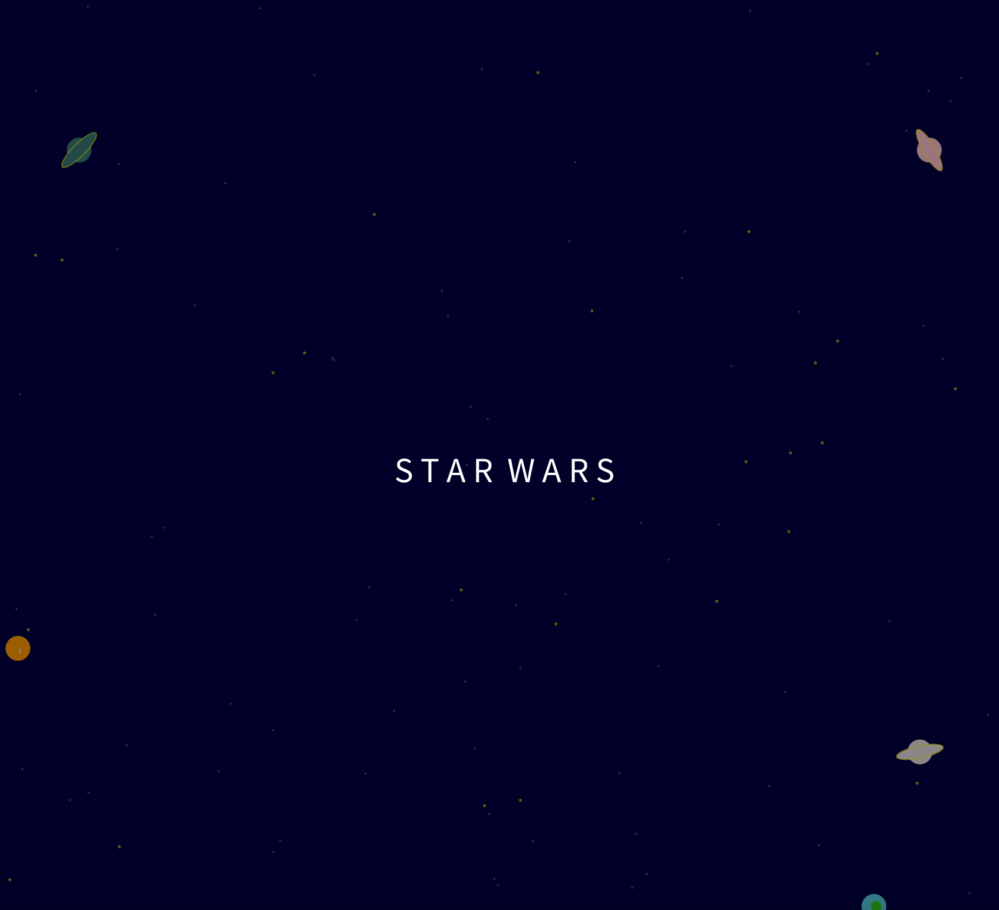
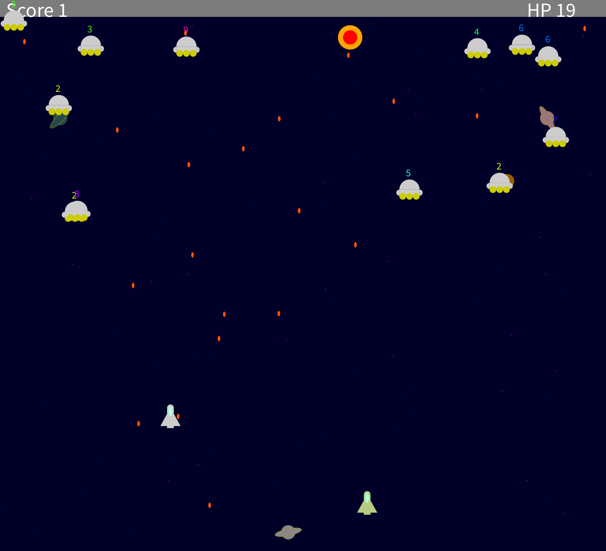
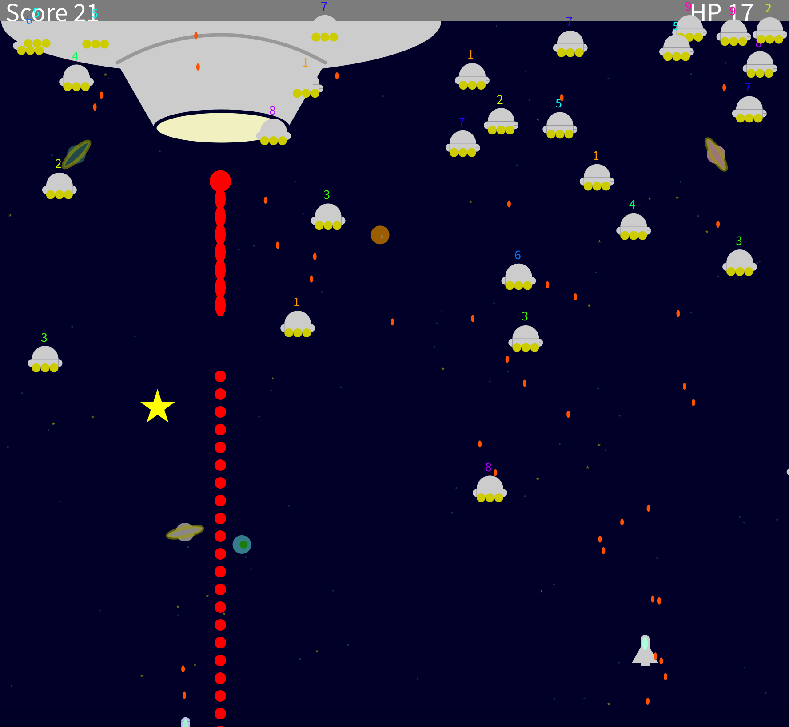

# 宇宙大戦争（シューティングゲーム）

Processingで開発した2Dシューティングゲームです。プレイヤーは敵を倒しながらステージを進み、最終ボスを目指します。
音声やアイテム、エフェクト、味方や敵が出現するやりごたえのあるゲームです。

---

## ゲームキャプチャ
（スタート画面）
（戦闘シーン）
（ボス戦）

---

## ゲーム概要

- **ジャンル**: 2D縦スクロールシューティング
- **プレイ時間**: 約1〜2分（1プレイ）
- **特徴**
  - 多彩な敵のパターン
  - BGM・効果音付き
  - ボス戦の演出
  - アイテムドロップ
  - プレイヤーのパワーアップシステム
  - スコア表示・ハイスコア記録

---

## 操作方法

| 操作 | 内容 |
|------|------|
| マウス移動 | 自機の移動 |
| space   | 通常弾発射 |
| ESC | ゲーム終了 |

---

## 開発環境

- **Processing バージョン**: 3.2
- **サウンドライブラリ**: Minim

```java
import ddf.minim.*;

## ライブラリインポート
sketch/import library/add library/minim[Damien Di Fede and Anderson Mills]
